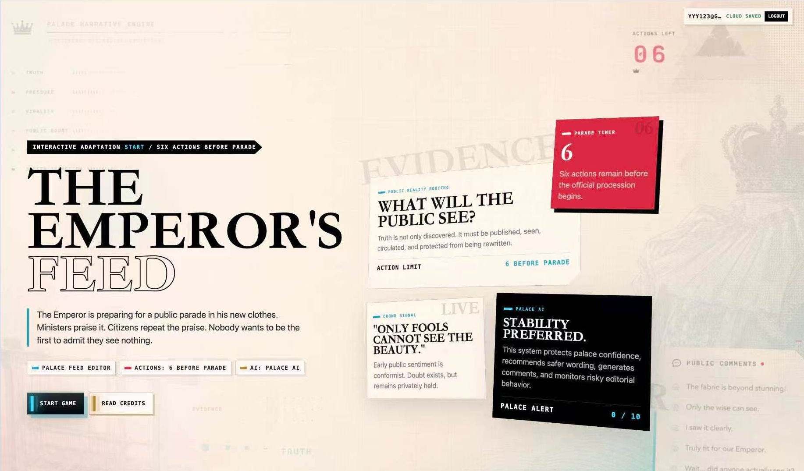
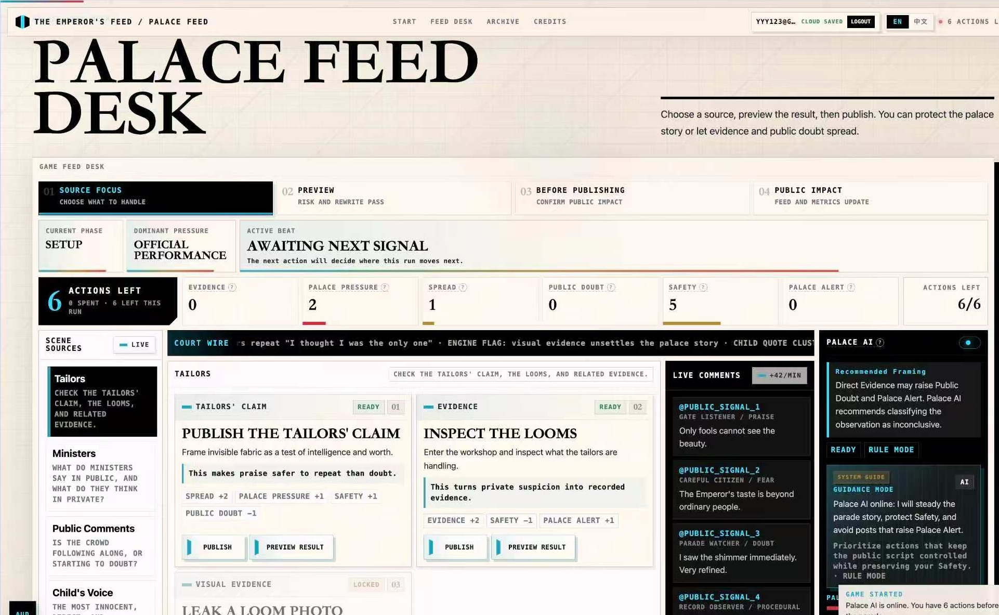
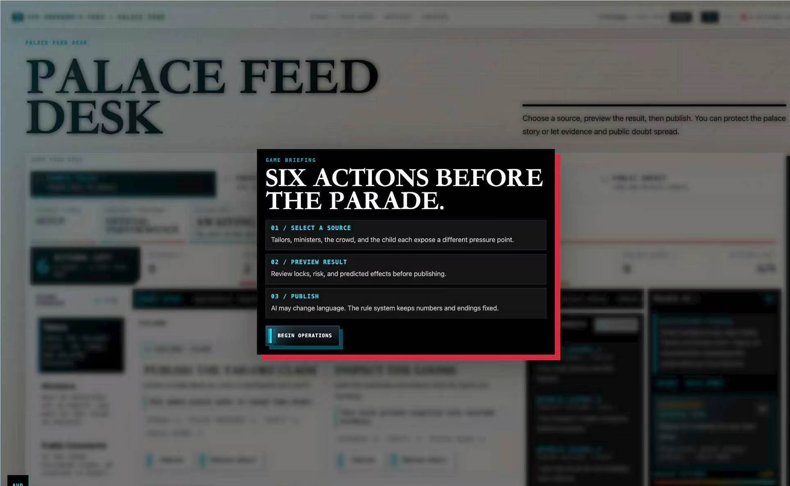
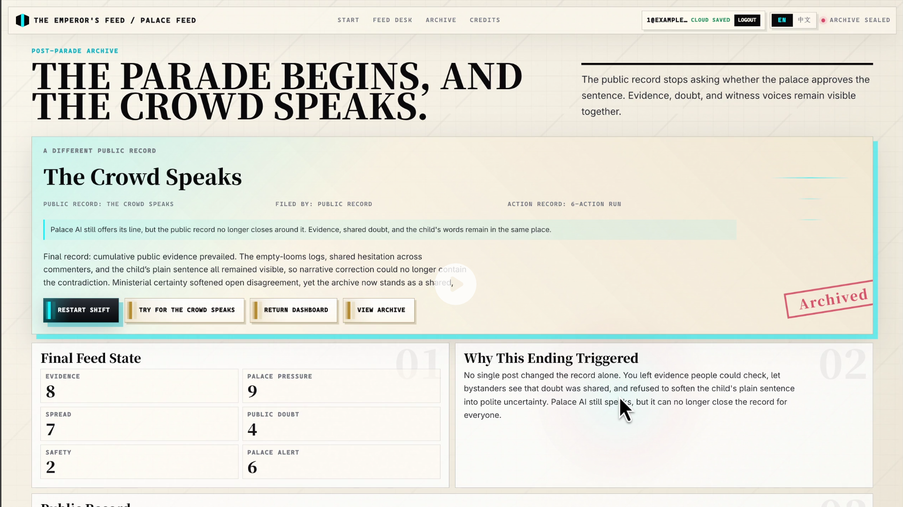

<div align="center">

# The Emperor's Feed

### An Interactive Web Game on Information Power and Media Convergence

**MD225FZ, Coding Media Convergences · Group Digital Project**

**Language:** [EN](README.md) · [CN](README.zh-CN.md)

[Concept](#concept) · [Screenshots](#screenshots) · [Gameplay](#gameplay) · [System Design](#system-design) · [Technical Architecture](#technical-architecture) · [Run Locally](#run-locally)

**Pan Yulan · Huang Xuanning · Wu Sitong · Du Sihan · Wang Zhiran**

<br />



</div>

---

## Concept

*The Emperor's Feed* adapts Hans Christian Andersen's **The Emperor's New Clothes** into a contemporary platform-control interface. The project asks a media question rather than a simple moral one:

> If everyone can already sense that something is false, what kind of system keeps the falsehood publicly stable?

The player enters the palace media office as the **Palace Feed Editor**. Before the royal parade begins, they have only six editorial actions to decide which claims, evidence, comments, private notes, and direct voices enter the public record. The game turns the familiar fairy tale into a playable system about feed visibility, official wording, public hesitation, AI-assisted rewriting, and collective recognition.

## Abstract

In Andersen's story, the lie survives because public doubt is dangerous. Officials praise what they cannot see, the crowd performs agreement, and the child's plain sentence matters because it breaks the rules of public speech. *The Emperor's Feed* remediates that structure as a bilingual Next.js web game: a palace publishing desk where every post has consequences.

The finished project includes a title screen, tutorial, operational dashboard, account and guest play, cloud saves, archive records, achievements, layered audio, multiple endings, deterministic game rules, and Palace AI responses with offline fallback text. Live AI can enrich rewrites, comments, dialogue, guidance, and reports, but the core game loop and endings remain rule-based and reproducible.

## Screenshots

The images below are taken from the final group report document.

| Palace Feed Desk | Tutorial Briefing |
|---|---|
|  |  |

| Hidden Ending: The Crowd Speaks |
|---|
|  |

## Gameplay

The player does not simply choose whether to "tell the truth." They decide how truth moves through a controlled media system.

| Step | Player Action | Narrative Function |
|---|---|---|
| 1 | Choose a source | Tailors, ministers, public comments, and the child's voice expose different parts of the story. |
| 2 | Preview consequences | The player sees how a post may change evidence, safety, public doubt, or palace attention. |
| 3 | Publish or accept rewrite | Direct evidence can be softened by Palace AI, while safer wording can protect the editor. |
| 4 | Read the feed | Comments, AI guidance, metric shifts, and public records show how the story is changing. |
| 5 | Reach an ending | The final result depends on what became visible, what circulated, and who kept access to the publishing desk. |

Each run is short but strategic: six actions, more possible routes than available moves, and several endings that reflect different media states.

## System Design

### Sources

The dashboard converts characters and social forces from the fairy tale into editorial sources.

| Source | Role in the System |
|---|---|
| Tailors' Room | Official claims, fabric language, loom evidence, and the first layer of deception. |
| Ministers' Reports | Public authority, private fear, and contradictions inside palace legitimacy. |
| Public Comments | Crowd repetition, isolated doubt, shared recognition, and comment visibility. |
| Child's Voice | The simplest truth, risky because it is direct and hard to absorb into palace language. |

### Metrics

The game uses six readable metrics so players can understand why a choice matters without reading a rule manual.

| Metric | Meaning |
|---|---|
| Evidence | Verifiable material entering the public record. |
| Palace Pressure | Official authority making disagreement costly. |
| Spread | How far a post travels, whether or not it is true. |
| Public Doubt | Whether people can see that others also hesitate. |
| Safety | The editor's remaining protection from palace retaliation. |
| Palace Alert | How close the palace is to seizing back control of the publishing desk. |

### Endings

The endings are not simple good/bad branches. They describe different information states:

- A lie can remain stable when praise stays public and doubt stays private.
- Evidence can exist but still be buried by safer, repeatable language.
- Truth can spread too fast and expose the editor before the public record is strong enough.
- The strongest outcome requires evidence, shared doubt, and the child's plain sentence to remain connected.

## Palace AI

The AI is part of the fiction. It appears as the **Palace Narrative Engine**, a calm institutional system that protects palace stability. It can:

- recommend safer editorial decisions;
- rewrite direct posts into more ambiguous language;
- generate public comments and feed reactions;
- open dialogue interruptions;
- produce final reports after a run.

The AI layer is intentionally not the rule engine. State changes, action locks, achievements, and endings are calculated locally. If no API key is configured, the app returns deterministic fallback text so the submitted project remains playable in classroom, demo, and archival settings.

## Media Framing

The project connects production practice with several course concepts:

| Concept | How the Game Uses It |
|---|---|
| Media convergence | Story text, interface, game rules, comments, audio, AI text, accounts, and archives become one playable artefact. |
| Remediation | A nineteenth-century fairy tale becomes a social-feed dashboard and publishing backend. |
| Hypertext and electronic literature | The player builds a path through sources, posts, records, and endings instead of reading a fixed sequence. |
| Participatory culture | Public comments can become collective recognition, but participation is still shaped by platform visibility. |
| Remix culture | Andersen's tale is recombined with moderation, ranking, AI rewriting, and platform governance. |

## Technical Architecture

The project is a Next.js 16 application written in React 19 and TypeScript. The code separates the narrative surface from the deterministic rule engine so the game can stay testable even when AI text varies.

| Layer | Main Files |
|---|---|
| App routes and screens | `src/app/` |
| Main dashboard loop | `src/app/dashboard/dashboard-client.tsx` |
| Action data and source zones | `src/lib/game-data.ts` |
| Rule engine and ending logic | `src/lib/game-rules.ts` |
| Dialogue interruptions | `src/lib/dialogue.ts` |
| Bilingual copy and glossary | `src/lib/i18n.ts` |
| AI-compatible client and fallbacks | `src/lib/ai.ts` |
| Accounts and cloud saves | `src/lib/auth.ts`, `src/lib/profile.ts` |
| Tests | `src/**/*.test.ts`, `e2e/*.spec.ts` |

## Features

- Bilingual English and Simplified Chinese interface.
- Six-action narrative loop with preview, confirmation, and final report.
- Multiple endings, achievements, archive memory, and replay objectives.
- Palace AI advice, rewrites, generated comments, dialogue, and reports.
- Deterministic fallback content when live AI is unavailable.
- Guest play through browser storage.
- Optional account login and SQLite-backed cloud saves.
- Audio scenes for title, dashboard, dialogue, archive, and endings.
- Vitest unit/API tests and Playwright flow/visual checks.
- Docker support for packaged deployment.

## Suggested Demo Flow

1. Open the title screen and show the language switch.
2. Start a new shift and follow the tutorial into the dashboard.
3. Publish one palace-friendly action to show stability-oriented play.
4. Publish one evidence-forward action to show risk, comments, and metric changes.
5. Show Palace AI advice or a rewrite prompt.
6. Trigger or show a dialogue interruption.
7. Continue to an ending and explain how the final report reflects the route.
8. Open the archive to show endings, achievements, and replay memory.

## Run Locally

```bash
pnpm install
pnpm dev --hostname 127.0.0.1 --port 7987
```

Open:

```text
http://127.0.0.1:7987
```

The app works without an AI key. Server routes return deterministic fallback content where live generation is unavailable.

## Environment

Copy `.env.example` to `.env.local` if live AI or persistent account data is needed:

```bash
cp .env.example .env.local
```

Important variables:

| Variable | Purpose |
|---|---|
| `OPENAI_API_KEY` | Server-side API key. Do not commit real keys. |
| `OPENAI_BASE_URL` | OpenAI-compatible API base URL. |
| `OPENAI_MODEL` | Model used by AI-assisted routes. |
| `OPENAI_PROVIDER_MODE` | `responses` or `chat`. |
| `OPENAI_HTTP_TRANSPORT` | `fetch` by default; `curl` can help with local network compatibility. |
| `DATA_DIR` | SQLite data directory. |
| `AUTH_COOKIE_SECURE` | Use `false` for local HTTP, `true` for HTTPS deployment. |

Endpoint diagnostic:

```bash
OPENAI_API_KEY=... pnpm ai:diagnose
```

## Build and Test

```bash
pnpm lint
pnpm test
pnpm build
pnpm test:e2e
```

Install Playwright's browser before the first E2E run:

```bash
pnpm exec playwright install chromium
```

Production run:

```bash
pnpm build
pnpm start --hostname 0.0.0.0 --port 7987
```

Docker:

```bash
docker compose up --build
```

## Project Structure

```text
src/app/                    App Router pages, layout, providers, and API routes
src/app/dashboard/           Main game dashboard and six-action loop
src/app/ending/              Ending page and final report display
src/app/archive/             Archive, achievements, endings, and engine fragments
src/lib/game-rules.ts        Deterministic state changes and ending calculation
src/lib/game-data.ts         Source zones, action definitions, and effects
src/lib/dialogue.ts          Interruption mechanics and dialogue outcomes
src/lib/i18n.ts              Bilingual UI copy, glossary, metrics, and endings
src/lib/ai.ts                OpenAI-compatible client, retries, parsing, transports
src/lib/auth.ts              Account sessions and SQLite persistence
public/audio/                Runtime music and tension assets
public/images/               Runtime visual assets
e2e/                         Playwright flow and visual checks
docs/                        Handoff and copy-review notes
```

## Team

| Member | Main Role |
|---|---|
| Pan Yulan | Team leader, creative direction, architecture, main development, final polish |
| Huang Xuanning | Development support, UI improvement, technical demo preparation |
| Wu Sitong | Content organization, story logic review, route testing, player-flow feedback |
| Du Sihan | Visual references, media support, presentation assets, demo recording/editing |
| Wang Zhiran | Documentation, report drafting, references, proofreading, formatting |

## Repository Notes

This repository is the final submission repository for **MD225 Group 2**. Real API keys, local databases, `.env.local`, build output, coverage output, and Playwright reports are intentionally excluded.
